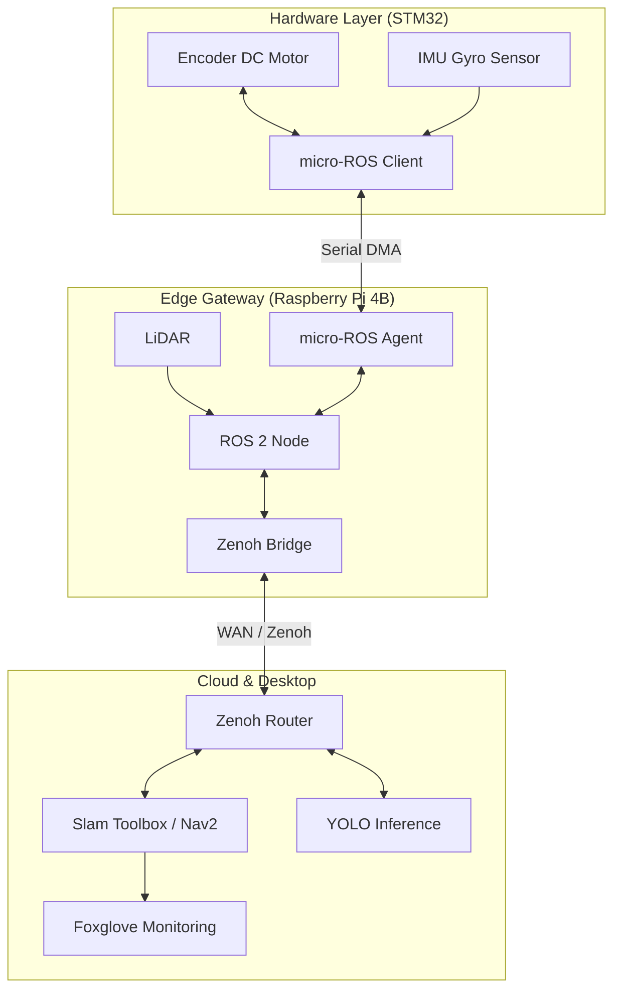

Integrated Autonomous Mobile Robot (AMR) System
STM32, Raspberry Pi, micro-ROS 및 Zenoh를 활용한 클라우드 연동 자율주행 서비스 로봇

본 프로젝트는 하드웨어 제어부터 클라우드 기반 AI 연산까지 로봇 시스템의 전 계층을 통합한 End-to-End AMR 시스템 구축 프로젝트입니다. 좁은 실내 환경에서의 정밀한 주행을 위해 차동 구동(Differential Drive) 방식을 채택하였으며, 내부망의 제약을 극복하기 위해 Zenoh를 통한 외부망 노드 확장을 구현했습니다.

    🚀 Key Features
Full-Stack Integration: STM32(Firmware) - Raspberry Pi(Edge) - Desktop(Cloud)를 잇는 로봇 파이프라인 구축
Sensor Fusion Odometry: 엔코더 데이터와 IMU(Yaw) 값을 결합한 정밀 오도메트리 구현 및 SLAM 맵 품질 향상
Cloud Robotics (Zenoh): DDS의 통신 한계를 극복하고 Zenoh Bridge를 활용해 외부망(WAN) 환경에서 로봇 노드 제어 및 모니터링 성공
Intelligent Interaction: YOLO 기반 객체 인식을 통한 지능형 진열대 탐지 및 서비스 로봇 시나리오 통합

🛠 Tech Stack
Category	Tech & Tools
Firmware	STM32F446RE, C, HAL, FreeRTOS, micro-ROS
Edge Compute	Raspberry Pi 4B (Ubuntu 24.04), Docker
Middleware	ROS 2 Jazzy, micro-ROS Agent, Zenoh-bridge-ros2, DDS
Autonomous	SLAM Toolbox, Nav2, AMCL, robot_localization (EKF)
AI / Vision	YOLOv8, OpenCV, RPLidar A1
Cloud / Tool	AWS (EC2), Foxglove Studio, Gitlab CI/CD

 
